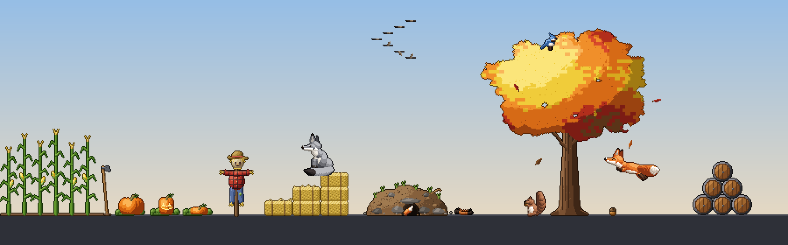

# Pixel Fox



Two pixel foxes, one orange and one grey, live along the top of your taskbar. They wander, nap,
play together and chase leaves. You can pet them, pick them up and give them toys. The seasons change
what's around them. The oak changes with the seasons: bare (or snowy) in winter, budding with flowers
underneath in spring, deep green in summer. In autumn it drops colourful leaves and acorns, and there's a squirrel,
a blue jay, a woolly bear caterpillar, geese and a flock of wild turkeys who come by. Crows visit all year
round: they perch in the tree, on things or on the ground, and if they stay a while they play with what's
lying about.

## Start

Double-click **Pixel Fox.exe** (or **Pixel Fox.cmd**, or run `.\start.ps1` in PowerShell).

**Screen saver:** right-click **Pixel Fox.scr** and choose **Install** (it stays in the Pixel Fox folder), then
pick it in Windows' screen saver settings. Start Pixel Fox once first, so it knows where Python is. Only a mouse
click or a key press closes the screen saver; moving the mouse doesn't.

Pixel Fox.exe starts it with no window at all. Right-click it to pin it to the taskbar or Start, or to make a
desktop shortcut; keep the .exe itself in the Pixel Fox folder. If it can't start, it tells you, and
Pixel Fox.cmd shows what went wrong.

It installs PySide6 and Pillow the first time (just for you, if installing for everyone isn't allowed),
then runs with no console window. Starting it again while it's running does nothing.

**Updates:** each time you start it, it first checks GitHub for a newer version and installs it, keeping
your settings. If you're offline it just starts the version you have. To turn this off, put an empty file
named `no-update` in the Pixel Fox folder. The current version shows when you hover over the tray icon.

## Works on

- **Windows 10 and Windows 11**, with **Python 3.9 or newer**, from python.org, the Microsoft Store or the
  `py` launcher. The start script finds it, and tries each one first so the Store's placeholder is never used.
- **Any number of monitors**, any sizes and scaling. The screens are joined left to right as Windows
  arranges them. Foxes walk from one to the next, and items always sit wholly on one screen.
  Plugging in, unplugging or rearranging a monitor while it runs is picked up straight away.
- **Taskbar anywhere:** at the bottom, the pets stand on it. At the top or a side, or when auto-hidden,
  they stand on the bottom of the screen.
- **Taskbar icons for treasure digging:** found the Windows 10 way, the Windows 11 way, or from the whole
  taskbar as a fallback. If none of those works, the foxes just don't dig for treasure.
- **Settings** are kept in `user-data` next to the app, or in `%LOCALAPPDATA%\PixelFox` if the app's folder
  can't be written to (for example in Program Files).

## The toy box

Click the fox icon in the system tray to open the **Toy Box** window. Tick or untick each fox and item to
put it out or away. Items from another season show in italics and come out when their season does.
Right-click the icon for the menu:

- **Foxes**, then the items out all year and this season's, as checkboxes. (The Toy Box window has a tab for
  each season.)
- **Things to do:** **Shake down an acorn**, **Plant new pumpkins / corn / watermelons**, **Replant the
  garden**, **Dig up a taskbar treasure**, **Zoomies!**, **Make it blustery**, **Make it rain**, **Make it
  snow**, and **Invite a visitor** (squirrel, blue jay, caterpillar, geese, wild turkeys, crows, cicada, June
  beetle, ladybug, butterflies, songbirds, depending on the season, and the owl). In winter, **Snow on the
  oak** turns the snow on or off.
- **Local weather (rain and snow):** rain or snow falls when it's raining or snowing where you are (see below).
- **Season:** follows the date (northern hemisphere), or preview any season.
- **Size:** 1x, 2x or 3x.
- **Pause**, and **Quit**.

## Playing with them

- **Pet:** move the cursor back and forth over a fox. It only ever reacts happily.
- **Click:** a happy hop. A napping fox wakes up and stretches.
- **Drag a fox:** you pick it up, and it lands when you let go.
- **Spring:** daffodils, tulips and violets that butterflies land on, songbirds that sing, a stone well with a
  bucket, dandelion clocks to blow, and radishes and lettuce to pull up when they're ripe.
- **Summer:** a slide and a kiddie pool for the foxes, watermelons and tomatoes to harvest, cattails that burst
  into fluff, dandelions, pansies under the trees and a dahlia bed.
- **Autumn:** an apple barrel to roll apples out of (and the pumpkins, the corn, the scarecrow and his hat).
- **Winter:** a sled to rock, a woodstack and a tree stump the foxes climb, and a little Christmas tree whose
  lights blaze when clicked.
- **All year:** the oak and a white birch, both changing with the seasons. Corn cobs and fruit can be picked up
  and dropped somewhere else.
- **Click the oak:** something different falls out each season: a branch, snow, a caterpillar, a butterfly,
  autumn leaves (and now and then a spider on its thread).
- **Drag the oak:** you can move it anywhere along the bottom of the screen, and it remembers the spot.
- **Drag the hoe onto a ripe pumpkin:** it carves a jack-o'-lantern.
- **Click ripe corn:** an ear drops from every stalk, and the crows will soon be round for it.
- **Crows** chat, play with what's lying about, and sometimes borrow the scarecrow's hat. Click one to shoo them;
  if it drops the hat, click the hat to put it back.
- **Rest the cursor near the bottom of the screen:** a playful fox may crouch, wiggle and pounce on it.
- **Throw a dug-up taskbar icon:** pick it up and fling it. It bounces like a ball and a fox fetches it back.
- **Desktop folders:** now and then a fox pulls a folder icon down and drags it somewhere else along the bottom
  of the screen (only the icon moves). **Put the desktop folders back** in the tray menu puts them all back;
  untick "Move folders about on the desktop" in the Toy Box to stop it.
- **At night:** jack-o'-lanterns and the Christmas tree glow, fireflies blink on summer nights, and an owl
  comes to sit in the oak or the birch. On snowy days the foxes leave paw prints.

### Local weather

Pixel Fox asks [Open-Meteo](https://open-meteo.com) (free, no account or key) about the weather every half
hour. It sends only a rough location: the city it picked from your computer's time zone (the same one it uses
for sunrise and sunset), or the place in `user-data/world.json` under `"location": {"lat": .., "lon": ..}`,
rounded to about 10 km. If it's raining or snowing there, it rains or snows on your desktop, and in winter real
snow on the ground means a snowy day. Without internet it simply carries on as before. Untick **Local weather**
in the tray menu to stop asking.

Clicks on empty parts of the screen go straight through to your desktop and windows.

## How it works

```
Pixel Fox.exe      double-click to start (runs start.ps1; source in launcher/)
Pixel Fox.scr      the screen saver (runs pixelfox.py --scr; pet/saver.py draws it)
pixelfox.py        start here
start.ps1          checks for updates (update.ps1), installs what's needed, starts it
pet/world/         everything on the desktop and how it behaves (no Qt): core, garden, visits, foxplay,
                   friends, mischief, outdoors
pet/fox.py         a fox's moods (playful, bored, sleepy; no hunger) and how it picks what to do
pet/items/         things on the desktop: base bits, garden, trees, yard, toys, sky
pet/visitors/      creatures that come and go: autumn, crows, bugs, spring, night
pet/view/          the windows and tray: frames, windows, stage, toybox, discord_pics
pet/seasons.py     which season it is and what belongs to it
pet/sky.py         where the sun and moon are (and the moon's phase)
pet/weather.py     is it raining or snowing where you are? (Open-Meteo, every half hour, in the background)
pet/desktop_icons.py  the desktop's folder icons: where they are, and moving them (Windows)
pet/save.py        user-data/world.json: what's out and where
art/world_art/     draws everything that isn't a fox, one file per theme; art/fox_art.py draws the foxes
art/make_art.py    writes every sprite into art/sprites/ (python art/make_art.py --preview to see them all)
tests/             python -m unittest discover -s tests (one file per topic; helpers.py is the shared set-up)
CHANGELOG.md       what changed in each version (the version is in pet/__init__.py)
```

## Your own art

Every sprite is a PNG strip in `art/sprites/` with a JSON file of the same name. The JSON gives the frame
size, the number of frames, milliseconds per frame, whether it loops, and the anchor point (where it
touches the ground). To use better art, replace the PNG and its JSON; no code changes are needed. Foxes
face right, and the app mirrors them to face left. Run `art/make_art.py` again only if you want the drawn
art back.
